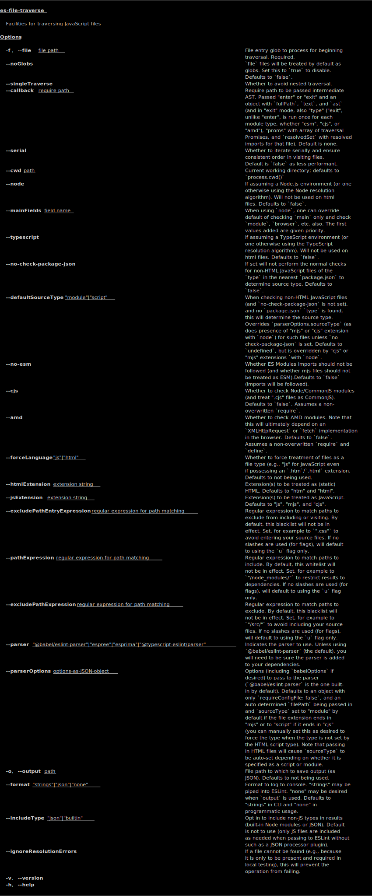

[](https://www.npmjs.com/package/es-file-traverse)
[](https://david-dm.org/brettz9/es-file-traverse)
[](https://david-dm.org/brettz9/es-file-traverse?type=dev)

[](badges/eslint-badge.svg)
[](badges/eslint-thirdparty.svg)

[](badges/tests-badge.svg)
[](badges/coverage-badge.svg)
<!--
[](https://github.com/brettz9/es-file-traverse/actions)
-->

[](https://snyk.io/test/github/brettz9/es-file-traverse)
[](https://lgtm.com/projects/g/brettz9/es-file-traverse/alerts)
[](https://lgtm.com/projects/g/brettz9/es-file-traverse/context:javascript)

<!--[](LICENSE-MIT.txt)-->
[](badges/licenses-badge.svg)

(see also [licenses for dev. deps.](https://raw.githubusercontent.com/brettz9/es-file-traverse/master/badges/licenses-badge-dev.svg?sanitize=true))

[](https://issuehunt.io/r/brettz9/es-file-traverse)

# es-file-traverse

Allows traversing ECMAScript (JavaScript) files by their `import`/`require`
chains, building a list of files and optionally executing a callback with
the file name, source and AST.

## Installation

```shell
npm i es-file-traverse
```

## Comparison to other projects

This project is similar to [imports-visitor](https://www.npmjs.com/package/imports-visitor),
but it uses `babel-eslint` so as to report ESTree (ESLint) AST.

## Usage with ESLint

One of the motivations behind this library was to allow linting of code from
third parties, not for stylistic purposes, but to avoid introducing serious
vulnerabilities or globals and other intrusions.

While one can opt to lint `node_modules`, this can be a heavy hammer, as:

1. Not all of your production code uses every folder in `node_modules`.
2. You may get other errors from files you are not actually using (including
    possibly files that were accidentally included in the dependency you are
    checking as mere test files). While you may wish to be a good citizen
    and lint the whole package, `es-file-traverse` lets you confine yourself
    to those public APIs that are of most concern and may impact your users.

`es-file-traverse` can be used with ESLint to target files for linting which
are actually used by your application (not the ESLint behavior of checking
all files in a directory unless ignored, but following imports/require
statements into (and possibly out of) `node_modules` to find the files
used by your script(s)). For browser applications, it is recommended you
point `es-file-traverse` to your HTML files to ensure the source type
(module or script) is set properly and automatically. For Node applications,
it is recommended you do not set `--no-check-package-json` as this
wil allow you to detect source type properly for Node.

For an example, you can see that `es-file-traverse` adds its own linting
of third party scripts, using the config [`.eslintrc-3rdparty.js`](./.eslintrc-3rdparty.js). Note that this is a small subset of the rules we use on our
own project, and is instead focused on checking for more serious
vulnerabilities or intrusive practices (e.g., `no-eval` or `no-global-assign`).

It is recommended that you use suitable
[ESLint's command-line flags](https://eslint.org/docs/user-guide/command-line-interface). Here are the flags we are using with a quick summary of why:

- `--no-inline-config` - 3rd parties may disable rules you wish to check
    or they may reference rules which your config does not include,
    causing linting errors.
- `--no-ignore` - Don't apply our own `.eslintignore` to the explicit
    list of third party files we are including.
- `--no-eslintrc` - We don't want to check the normal hierarchy of
    `.eslintrc.*` files, as these are used by our and other projects' for
    their stylstic concerns. We instead use `--config` to indicate the rules
    we wish to be applied.
- `--config` - Indicates the actual rules we want applied to third party
    files discovered to be used by, or by the dependencies of, the `--file`
    file passed to `es-file-traverse`.

We use the backticks to ensure that the list of files returned by
`es-file-traverse` is passed on to `eslint`.

```sh
eslint --no-inline-config --no-ignore --no-eslintrc --config .eslintrc-3rdparty.js `es-file-traverse --file ./bin/cli.js --node --cjs`
```

(Note that we actually use `node ./bin/cli.js` instead of `es-file-traverse`
in our script as our own binary file is not available to us, but it is when
installed, so you can use `es-file-traverse` with your own scripts.)

## Usage with `eslint-formatter-sourcemaps`

In normal linting you typically wish to enforce stylistic checks on your
project, so you will mostly want to target source files in such linting.

However, when linting third party code (e.g., to check for security
vulnerabilities or intrusive practices)--a compelling use case of
`es-file-traverse`--distribution files are generally preferable as targets,
as they are the final authority on the code of your project that will be
executable (including any embedding or importing/requiring of 3rd party
code, e.g., within `node_modules`). (Also note that if using `--typescript`
mode, `es-file-traverse` will, as per the TypeScript module resolution
algorithm, follow `.d.ts` declaration files rather than the resulting
`.js` files, so if your source is TypeScript, this is another reason you
may not want to trouble parsing source.)

But the default ESLint formatter won't follow sourcemaps to tell you
where the original source file for the problematic code is, so you may, as
needed, report a problem to the third party or avoid its dependency.
You may therefore also wish to use
[eslint-formatter-sourcemaps](https://github.com/brettz9/eslint-formatter-sourcemaps)
with your `es-file-traverse`-driven `eslint` linting process in order to
get the original paths shown for any linting violations.

## Usage with `eslint-formatter-badger`

Once we are linting files from our own projects, and particularly when we are
linting third party dependencies, we may wish to inform consumers of our
project of the degree to which we have looked out for weaknesses, such as by
listing the number of rules passing or the types of rules (e.g., for
vulernabilities or intrusive code).

See [eslint-formatter-badger](https://github.com/brettz9/eslint-formatter-badger)
for more on how to do this, in particular the section
``"Usage with `es-file-traverse`".``

## CLI



## To-dos

1. Build globals list for users also!
1. Options
    1. Option to give an error or report listing **files which were not
        traversed** but within a set of specified files.
1. Iteration methods
    1. For modules, check also for `require` when Node's `module.createRequire`
        or `module.createRequireFromPath` are used.
    1. Utilize **import maps** then return that result with file name/path
        (and module type used, e.g., if multiple module types
        are being queried).
    1. Handle **dynamic `require` or `import`** (or `define`?) (e.g., pass
        back the file name and expression)?
    1. Support **transpiling** (e.g., Rollup with node-resolve and CJS plugins)
    1. **`fetch` or `XMLHttpRequest`** could be used with `eval` but that
        rule could not be readily used without a lot of complexity.
    1. Follow through with any **binaries** that are executed (e.g.,
        `child_process.spawn('node_mod_a')` ->
        `node_modules/.bin/node_mod_a` ->
        `node_modules/node_mod_a/cli/index.js`); could have linting to ensure
        though that instead of spawning raw `node_mod` which could conflict
        with a native `node_mod_a`, should use fixed paths for child processes.
        Could, however, whitelist certain trusted native executables, albeit
        with a potential risk of namespace conflicts.
    1. Esp. if ESLint started supporting linting of URLs, we could
        provide **loading of HTML from a server** (as with a `baseUrl`; see
        commit history for a partial attempt); would return URLs instead
        of files as well.
1. Uses elsewhere:
    1. **Linter**: Propose this traversal mechanism as a **command line
        option for eslint itself**, esp. if get as a working demo (in
        place of, or in addition to, a set of whitelisted files).
        1. tern-like linting validator; build scopes across files with
            `escope` and use for checking function calls/references.
        1. Perform linting (or if doing along the way, only perform linting
            once per discovered file). Traversal code should remain
            separate so can keep a useful generic traverser by
            import/require (dynamic or static) rather than becoming a linter.
        1. Ensure linters can lint any extension found for an imported/required
            file, not just those with `--ext` at command line.
        1. With a need to follow through the individual files anyways, we can
            also check along the way whether this is strict mode file or not,
            and lint that file accordingly, avoiding undue parsing failures.
            Can also avoid errors when the file type is detected as JSON
            (requiring a JSON file) or if the feature of registering a file
            type was used (then handling that as appropriate).
        1. Check source maps to refer back to source
            1. See also:
                1. <https://github.com/Bartvds/eslint-path-formatter>
                1. <https://github.com/a-x-/eslint-path-formatter2>
        1. Allow collecting whole modules in use rather than files, so
            can indicate desire to lint entire modules in use (e.g.,
            so as to report back problems across the whole repo)
    1. Use esp. for `eslint-plugin-privileges` (and `eslint-plugin-query`).
    1. Use for `eslint-plugin-jsdoc` in getting at defined variables
    1. **Validate JavaScript with JSDoc** alone (no TypeScript needed),
        e.g., function calls which are supplying the wrong type; added
        as `eslint-plugin-jsdoc` to-do
    1. Validate function signatures, etc., as with `eslint-plugin-jsdoc`,
        but finding the source of each `/** @type */` and subsituting
        its `@typedef`.
    1. Use for gathering info to use in **autocomplete** (not only import
        paths but variables/symbols)?
    1. Collect comments (which have no AST)
    1. See uses in `eslint-plugin-query` to-dos
    1. Note: if looking also for what is *exported*, e.g., to know what
        globals are, if non-module mode in browser, should look at `var`
        and even `const`/`let`; can then use, e.g., for
        `jsdoc/no-undefined-types`; as with `no-unrestricted-properties`,
        etc., we want to find out when `window` or other globals are used,
        but to collect the uses, rather than report them.
